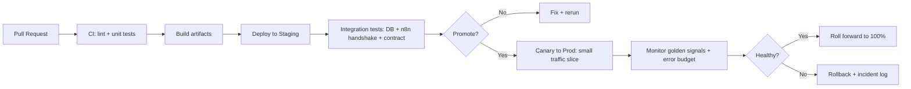
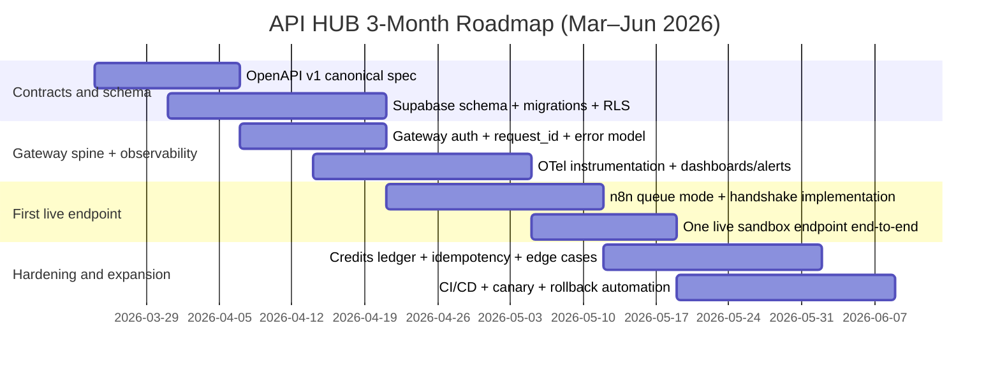

# Deep Research Baseline and Best Practices for an API-Hub Developer Platform

## Executive summary

You are building a developer-facing API platform that productizes two classes of capabilities: (a) “resource/data APIs” (transcripts, curriculum, knowledge-base search) and (b) “automation/tool APIs” (scrape/analyze/enrich/search) exposed behind a single gateway, with a premium portal experience. fileciteturn0file6 fileciteturn0file16

In your repository today, the “portal experience” is the most mature artifact: the Next.js portal exists and demonstrates endpoint discovery, a playground, keys/usage/billing concepts, and a UX model focused on “toolbox → test → integrate.” fileciteturn0file21 The backend gateway, Supabase schema, and n8n workflow execution are explicitly not implemented (the catalog is simulated and mostly mock-backed today). fileciteturn0file7

The best-practice baseline for a platform like this is to treat the gateway as a financial and security boundary (auth, rate limits, metering, audit logs, response shaping) and treat workflow execution as untrusted upstream capacity that must be wrapped with strict contracts, correlation IDs, timeouts, and deterministic billing semantics. This matches your stated architecture intent. fileciteturn0file9 fileciteturn0file14

Your most important near-term engineering risk is “truth drift”: the portal’s catalog, the drafted V1 contract, the eventual OpenAPI spec, the gateway implementation, and the n8n handshake can easily diverge unless you promote a single canonical contract source and put contract tests around it. Industry practice strongly favors a design-first API description (OpenAPI), enabling generation of docs/SDKs and automated conformance checks. citeturn0search0turn14search15 fileciteturn0file7

Your second major risk is “billing correctness under failures.” You currently plan “charge only on successful 2xx completion; don’t charge on 4xx/5xx/timeouts/upstream errors.” fileciteturn0file11 This is developer-friendly, but it creates hard edge cases: gateway-to-n8n timeouts (504) when a workflow continues, upstream costs incurred despite “no-charge,” and concurrency races that can overspend balances. Solving this typically requires (1) an append-only credit ledger, (2) idempotency keys for any operation with side effects, and (3) explicit semantics for “timeout” and “cancellation.” citeturn10view0turn1search2turn7search3

From a best-practice standpoint, you are already strong on: consistent response envelope + error code taxonomy; explicit observability fields; a documented gateway↔workflow handshake; and governance boundaries (decision log + operating model + legal guardrails). fileciteturn0file12 fileciteturn0file15 fileciteturn0file14 fileciteturn0file2 fileciteturn0file1

The most corrective next steps are: make OpenAPI the canonical V1 contract; define and implement the Supabase schema (including credit ledger + usage events + key hashing); implement a minimal live gateway path for one endpoint with end-to-end observability; and formalize CI/CD, tests, and runbooks so launch/rollback becomes routine rather than heroic. citeturn0search0turn2search3turn6search0turn5search0 fileciteturn0file13

## Baseline of what you are building

Your documents describe a platform with a clear separation of concerns:

- The portal (“the console”) is the developer experience surface: endpoint catalog, docs, playground, snippets, keys, usage, billing, logs. fileciteturn0file16 fileciteturn0file21  
- The gateway (“the control plane”) is the enforcement point: API key validation, rate limiting, credit checks/deduction, request logging, and response shaping, then routing either to Supabase-backed “resource APIs” or to n8n-backed “automation APIs.” fileciteturn0file9 fileciteturn0file18  
- Supabase is the system-of-record for identities, keys (stored safely), credit balances/ledger, usage logs, and job states. fileciteturn0file9  
- n8n is the execution substrate for automation endpoints, reached through internal webhooks with a strict internal envelope and correlation headers. fileciteturn0file14  
- A launch/rollback runbook defines the first “mock → live” cutover, with smoke scenarios and rollback triggers focused on contract correctness, correlation, and billing safety. fileciteturn0file13  

The current repo state (as of March 17, 2026) is explicitly: portal is real, but gateway/runtime is simulated; most runs are mock provider behavior, with one internal preview-backed route for local business search. fileciteturn0file7 The decision log also locks a key governance choice: the frontend endpoint registry remains the code-level truth for the catalog until a live backend/OpenAPI becomes the runtime contract owner. fileciteturn0file0

A best-practice “baseline definition” for what you are building can be stated precisely:

- A contract-first API product whose canonical public contract is an OpenAPI description. OpenAPI is the industry standard interface description for HTTP APIs and supports both human and machine consumers. citeturn0search0turn0search12  
- A gateway that implements cross-cutting concerns typical of API gateway patterns: auth, rate limiting, quotas, analytics/audit, and policy enforcement before routing to internal services. citeturn12search0turn12search8  
- A workflow/orchestration layer for automation endpoints, where webhooks can act like API endpoints but need production scaling patterns (e.g., queue mode with workers/webhook processors) to be reliable under load. citeturn2search0turn2search9  

### Reference system flow diagram

```mermaid
flowchart TD
  A[External Developer Client] -->|HTTPS + API Key| B[API Gateway (FastAPI)]
  B --> C{Authenticate + Authorize}
  C -->|invalid| E[Return 401/403 + error envelope]
  C -->|valid| D{Rate limit + concurrency gate}
  D -->|limited| F[Return 429 + error envelope]
  D -->|allowed| G{Validate request payload}

  G -->|invalid| H[Return 422 validation_error]
  G -->|valid| I{Route by endpoint type}

  I -->|Resource API| J[(Supabase Postgres)]
  I -->|Automation API| K[n8n Webhook Endpoint]

  B --> L[(Usage Log + Credit Ledger)]
  K --> M[External APIs/Providers]
  J --> B
  K --> B

  B --> N[Return public envelope + request_id]
```

This diagram reflects your intent: gateway is the control plane, Supabase is the truth layer, workflows are internal. fileciteturn0file9 fileciteturn0file14

## Industry best practices across the dimensions you listed

This section summarizes current best practices for a developer-facing API platform with a gateway + database + workflow engine, aligned to your stack.

### Architecture patterns

A gateway pattern is commonly used to centralize policy enforcement and provide a single entry point for clients, but it should avoid becoming an overly coupled “monolithic aggregator” if the system evolves into multiple services. citeturn12search8turn12search0 Your present architecture is appropriate for an early-stage platform because you have one gateway, one DB, and one workflow substrate. fileciteturn0file9

Best practice additions for your specific architecture:

- Treat execution engines (n8n/workflows/providers) as “untrusted upstream” and put a strict internal contract around them, including authentication, correlation IDs, and explicit timeout/retry policy. fileciteturn0file14  
- Use standardized correlation/trace propagation across gateway ↔ workflow ↔ provider calls using W3C Trace Context headers (traceparent/tracestate) and/or an explicit request_id. citeturn11search3turn0search3 fileciteturn0file15  

### API design and versioning

**Contract-first design with OpenAPI.** The OpenAPI Specification provides a language-agnostic description for HTTP APIs used to generate documentation, server stubs, and client SDKs. citeturn0search0turn14search3turn14search7 FastAPI also explicitly supports generating client SDKs from its OpenAPI output (or a maintained OpenAPI file). citeturn14search15

**Versioning discipline.** Major versioning in the path (e.g., /v1) is common and supported by many guidelines; different approaches have tradeoffs (path vs header vs query). citeturn1search1turn1search4 A stable component should avoid breaking changes within a major version; breaking changes require a new major version and a controlled deprecation path. citeturn1search0turn1search4

**HTTP semantics and safety/idempotency.** HTTP defines “safe” methods (GET/HEAD/OPTIONS/TRACE) as read-only semantics, and defines idempotent methods (PUT/DELETE and safe methods) as safe to retry automatically under certain failure conditions. citeturn10view3turn10view2 Best practice for API platforms is to:
- avoid request bodies on GET (intermediaries and tooling often ignore or mishandle them),
- put side-effectful operations behind POST/PUT/PATCH,
- add an Idempotency-Key mechanism for POST operations that can be retried while preventing double-execution, especially when billing is involved. citeturn10view2turn1search2

**Error model standardization.** You already have a consistent error envelope and stable machine-readable error codes. fileciteturn0file12 Industry standards also exist for “problem details” responses (RFC 9457), which obsolete RFC 7807 and define a common structure for error details. citeturn11search1turn11search4 Your current envelope can remain, but adopting RFC 9457-compatible fields later can improve interoperability.

Important note: HTTP 402 “Payment Required” is reserved for future use in the HTTP semantics RFC. citeturn10view0 If you keep 402 for insufficient credits (your current plan), it should be documented as a product convention and treated as “non-standard but intentional.”

### Gateway and billing enforcement

The gateway is typically the charging authority and policy enforcement point (rate limit/quota/auth) rather than delegating those concerns to downstream services. This matches your design. fileciteturn0file11

Best practice for usage-based billing is to structure metering as durable events. Stripe describes usage-based billing as charging customers based on usage, and supports recording usage as metered events processed asynchronously. citeturn7search3turn7search0 Even if Stripe is only used for checkout/packs, the internal system should still treat metering as an auditable event stream or ledger.

Billing correctness best practices:

- Use idempotency keys on client requests that have side effects (workflows, spend), and store the first outcome associated with that idempotency key. Stripe’s idempotency guidance is a well-known reference for this style of behavior. citeturn1search2turn1search6  
- Use an append-only credit ledger in Postgres so each charge/refund/adjustment is explicitly recorded and audit-friendly (and so “credits remaining” becomes a derived value rather than mutable truth). This is a common financial-systems pattern and reduces “silent drift” bugs. citeturn7search3turn4search0  
- Define precise semantics for timeout: if the gateway times out and returns 504, either (a) the upstream must be cancelled and must not continue consuming paid resources, or (b) you accept possible upstream cost leakage and treat it as a pricing/margin issue. Your current doc says “don’t charge on timeout,” which is user-friendly, but you still need an upstream cancellation/timeout strategy to protect margin. fileciteturn0file11 fileciteturn0file14  

### n8n integration patterns and handshake reliability

You have already drafted the right contract components: internal auth header (X-Internal-Webhook-Secret), correlation headers (including X-Request-Id), and an internal response envelope with workflow_version and latency_ms. fileciteturn0file14

Production best practices for n8n specifically:

- Use scaling patterns appropriate for production traffic. n8n’s own documentation describes queue mode and notes that webhook processing can rely on Redis and may require dedicated webhook processor nodes for scaling inbound webhook requests. citeturn2search0  
- Treat the webhook response path carefully. n8n documents how Respond to Webhook behaves when workflows error before responding, and how response construction works. This matters because your gateway depends on a deterministic response envelope. citeturn2search1  
- Prefer explicit timeout budgets and avoid “unknown execution” under sync mode. Your handshake sets a 25s timeout and 0 gateway retries, which is conservative and reduces duplicate execution risk. fileciteturn0file14  
- Plan an async migration path for long-running endpoints using job IDs and separate “poll status” endpoints, rather than forcing long timeouts on synchronous HTTP calls. Your draft already sketches this path. fileciteturn0file14  

### Data schema and Supabase modeling

Your audit notes that you lack formal DDL/schema definitions today. fileciteturn0file10 Best practice is to lock the schema early for core platform primitives: accounts/users, API keys, endpoint catalog versioning (if it moves to backend), usage logs, credit ledger, and job/execution records. citeturn2search3turn2search18

Supabase-specific best practices relevant to your system:

- Use migrations as the source of truth, committed to version control; Supabase documents how to manage database migrations with the CLI and in CI. citeturn2search3turn2search14  
- Enable Row Level Security (RLS) on any table in an exposed schema; Supabase explicitly states RLS must always be enabled on tables stored in an exposed schema like public. citeturn2search2  
- Optimize RLS policies with indexes on policy-filtered columns to avoid performance cliffs at scale. citeturn2search5  

In your architecture, the gateway can use a service role to bypass RLS for internal server-side operations, while the portal (browser) must not have direct access to sensitive billing/log tables. That aligns with “browser clients call the gateway only,” as you note. fileciteturn0file17

### Security: keys, rate limits, auth

Best-practice baseline:

- Serve only HTTPS endpoints. OWASP’s REST Security Cheat Sheet explicitly recommends HTTPS-only to protect credentials like API keys and tokens in transit. citeturn3search0  
- Treat API keys as secrets: do not put them in query parameters and avoid exposing them in logs. Google’s API key best practices warn against using query parameters and recommend header-based usage to reduce leakage risk. citeturn3search9  
- Rotate secrets. While rotation schedules vary, Google IAM guidance commonly recommends key rotation (e.g., every 90 days) to reduce exposure from leaked keys. citeturn3search1  
- Use an internal secrets management policy for gateway↔workflow secrets and provider credentials. OWASP provides best-practice guidance for secrets management and key lifecycle controls. citeturn3search11turn3search4  

Rate limiting best practices:

- Pick a clear algorithm and enforce it at the edge. Token bucket and leaky bucket families are common; AWS API Gateway uses token bucket concepts for throttling, and Cloudflare discusses leaky bucket behavior and burst capacity tradeoffs. citeturn7search4turn3search3  
- Separate limits by environment (sandbox vs production) and add concurrency limits for expensive endpoints, which you already propose. fileciteturn0file17  

Auth model best practices:

- API keys are fine for server-to-server access and early-stage developer platforms, but OAuth 2.1 is the modern standard for delegated access and can become relevant if you later add user-scoped access or third-party integrations. citeturn5search3turn5search23  

### Observability: logging, metrics, tracing

You already specify “request_id everywhere,” required log fields, metrics, and alert thresholds. fileciteturn0file15 This aligns with widely adopted reliability practice: the “four golden signals” (latency, traffic, errors, saturation) from the Google SRE book are a strong baseline for monitoring user-facing systems. citeturn4search0

Modern best practice is to standardize telemetry with OpenTelemetry (traces, metrics, logs) and export via a vendor-neutral collector. OpenTelemetry provides specifications for signals, and the OpenTelemetry Collector is designed to receive/process/export telemetry in a vendor-agnostic way. citeturn0search3turn14search2

For distributed trace context propagation, W3C Trace Context defines standard HTTP headers to propagate tracing context across service boundaries. citeturn11search3turn11search10

### Testing strategy: unit, integration, contract, end-to-end, chaos

A widely adopted baseline is the practical “test pyramid”: a large base of unit tests, fewer integration tests, and a small number of end-to-end tests because e2e is costly and brittle. citeturn5search0

For an API platform, contract testing becomes unusually valuable because your “product” is the contract:

- Use OpenAPI schema conformance tests that validate every endpoint response matches the schema (success + every error code). citeturn0search0turn11search1  
- Use consumer-driven contract testing when you publish SDKs or have multiple internal consumers. Pact is a well-known toolset for consumer-driven contracts and explains how contracts are generated and verified. citeturn5search1  
- Use chaos testing/failure injection selectively once production exists. Netflix’s Chaos Monkey is a well-known example of intentionally terminating instances to verify resiliency practices. citeturn5search2turn5search18  

### CI/CD and deployment: canary, feature flags, IaC

For safe operations, you want “small changes, frequently deployed,” with controlled rollout.

- Canary releases: the Google SRE workbook provides a clear rationale for canarying changes by exposing them to a small slice of traffic first to reduce deployment risk. citeturn6search0  
- Progressive delivery tooling: controllers like Argo Rollouts support canary strategies on Kubernetes, enabling stepped rollout and analysis. citeturn6search3turn6search7  
- Infrastructure as Code: Terraform is a common IaC tool, and HashiCorp publishes recommended practices for organizing and governing Terraform workflows. citeturn6search1turn6search5  
- Delivery performance measurement: DORA metrics (deployment frequency, lead time, change failure rate, time to restore) are widely used to measure delivery effectiveness; DORA publishes updated guidance and definitions. citeturn4search2  

### Compliance, privacy, and operational runbooks

Your legal boundaries doc is a strong internal guardrail: minimize personal data collection, avoid logging sensitive content, and require human review for public legal claims. fileciteturn0file1

Industry best-practice frameworks to align with (without over-claiming compliance):

- NIST Privacy Framework is a voluntary tool for managing privacy risk. citeturn8search0turn8search8  
- OWASP logging guidance emphasizes capturing security-relevant events while avoiding sensitive data exposure in logs. citeturn8search2  
- SOC 2 is a common trust framework requested by customers; AICPA describes SOC 2 as reporting on controls relevant to Security/Availability/Processing Integrity/Confidentiality/Privacy. citeturn8search3  

Operationally, incident response should be treated as a discipline with runbooks/playbooks, not ad hoc heroics. Google’s SRE resources provide incident management guidance and emphasize actionable alerting. citeturn4search5turn4search1

### Option comparisons

Gateway patterns (fit vs complexity)

| Option | Strengths | Tradeoffs | Fit for your current stage |
|---|---|---|---|
| Build the gateway in FastAPI (your plan) | Maximum contract control; easiest to embed credits/ledger logic close to business rules; aligns with your “gateway is authority” posture. fileciteturn0file9 | You own ops, scaling, rate limiting implementation, and reliability work. | Best near-term if you ship 1–3 endpoints first. |
| Managed API gateway product (e.g., entity["company","Amazon Web Services","cloud provider"] API Gateway usage plans) | Built-in usage plans, quotas, and throttling by API key; fewer moving parts to stand up. citeturn7search1turn7search4 | Less flexible for custom credit semantics; still need an internal billing authority and ledger if “credits” are a product concept. | Good if you prefer managed infra and can adapt credit semantics to platform constraints. |
| Self-managed gateway proxy (e.g., Kong/Envoy) | Rich plugins for rate limiting and auth; Envoy supports external authorization via an out-of-process auth service. citeturn7search2turn12search2 | Adds gateway layer + adds operational surface area; still need your own metering/billing service. | Better after you have stable traffic and want standardized edge controls. |
| API management platform (e.g., entity["company","Microsoft","software company"] Azure API Management) | Central policy enforcement (auth, IP restrictions, rate limiting) and operational features. citeturn12search0 | Cost and vendor coupling; less “code-as-product” feel for custom credits/workflows. | Useful if enterprise customers demand it early. |

Billing enforcement strategies

| Strategy | Pros | Pitfalls | Recommendation for you |
|---|---|---|---|
| Prepaid credits, hard block, charge-on-success (your current posture) | Highly developer-friendly; no surprise charges; simple mental model. fileciteturn0file11 | Timeout/upstream edge cases can leak provider cost; concurrency races can overspend without careful locking/ledger. | Keep for V1, but implement ledger + idempotency + upstream timeout/cancellation. citeturn10view2turn1search2 |
| Credits with reservation/settlement (authorize → run → settle) | Prevents overspend; supports long-running jobs; easier to handle ambiguous outcomes (timeout). | More complex; must expire holds and reconcile. | Consider when you introduce async jobs. fileciteturn0file14 |
| Postpaid usage-based billing (metered usage) | Aligns with common SaaS billing; Stripe supports usage-based billing and recording usage events. citeturn7search3turn7search7 | Customer trust issues if errors are billed; requires robust metering pipelines and dispute handling. | Consider later or for higher tiers once reliability is proven. |
| Hybrid (included credits + overage) | Good enterprise pricing flexibility; can preserve “credits” UX while allowing overages. | More policy complexity and more customer support surface. | Phase 2+ once baseline is stable. |

Orchestration options for automation endpoints

| Orchestrator | Reliability model | Strengths | Tradeoffs | When to use |
|---|---|---|---|---|
| entity["company","n8n","workflow automation platform"] (your plan) | Webhook-triggered workflows; production scaling supported via queue mode with Redis and workers/webhook processors. citeturn2search0turn2search9 | Rapid iteration; low-code workflow composition; good for integrating many SaaS/tools quickly. | Needs discipline to enforce strict IO contracts; long-running tasks often better as async jobs. | Best for early productization and high-iteration automation catalog. |
| entity["company","Temporal","workflow orchestration vendor"] | Durable execution designed to survive failures; retries/timeouts are first-class. citeturn13search4turn13search0 | Excellent for long-running, stateful workflows and correctness. | More engineering-heavy; less “no-code”; operational overhead if self-hosted. | Best when workflow correctness and long-running state become core product. |
| AWS Step Functions | State machines with catch/retry semantics; managed. citeturn13search1 | Strong reliability + managed ops; native AWS integrations. | Vendor coupling; pricing/limits; may not match your “n8n workflow catalog” workflow authoring style. | Best if you commit to AWS-native execution for many endpoints. |
| Celery task queue | Tasks + retries; idempotency guidance exists (acks_late for idempotent tasks). citeturn13search2 | Flexible for Python workloads; good for internal async processing. | You must build orchestration semantics and visibility; not a workflow product. | Best for background jobs and internal processing, less for “workflow product.” |

## Current state vs best-practice mapping by dimension

The table below uses your documents as the “current state” and marks anything not specified in your docs as unspecified.

| Dimension | Your current state (from docs) | Best-practice baseline | Gap verdict |
|---|---|---|---|
| Architecture patterns | Clear 5-component model: portal → gateway → Supabase/n8n/storage. fileciteturn0file9 | Gateway pattern with strict upstream contracts; standardized tracing context; clear boundaries between public and internal services. citeturn12search8turn11search3 | Partially specified (needs concrete runtime details: cancellation, deployment topology). |
| API design & versioning | V1 draft exists; /v1 paths; consistent success envelope; lifecycle states (simulated/live/deprecated). fileciteturn0file8 | OpenAPI as canonical contract; versioning policy for breaking changes; avoid GET bodies; publish consistent pagination/filtering; add idempotency keys for side-effect POST. citeturn0search0turn1search4turn1search2 | Partially specified (contract not yet OpenAPI-first; GET request examples imply body usage). |
| Gateway/billing enforcement | Gateway is the charging authority; charge only on 2xx; credits schedule per endpoint. fileciteturn0file11 | Ledger-based metering, concurrency-safe debits, idempotency keys, deterministic retry semantics. citeturn10view2turn1search2turn7search3 | Partially specified (policy exists; implementation + edge cases unspecified). |
| n8n integration & handshake reliability | Strong handshake spec: internal secret header, request_id, workflow_version, timeout_ms=25000, no gateway retries. fileciteturn0file14 | Production n8n scaling (queue mode/Redis), explicit async job model for long tasks, contract tests, and resilience patterns around retries/timeouts. citeturn2search0turn2search1 | Partially specified (handshake good; production topology + async job model not fully specified). |
| Data schema & Supabase modeling | Supabase is named as source of truth; schema/DDL not defined; audit flags this as a gap. fileciteturn0file9 fileciteturn0file10 | Migrations-first schema; RLS for exposed tables; indexed RLS policies; ledger tables; usage events; job tables. citeturn2search3turn2search2turn2search5 | Unspecified at implementation level (needs full DDL + policies). |
| Security: keys, rate limits, auth | Security model defines sandbox/prod keys, internal secrets, logging restrictions, and rate-limit defaults. fileciteturn0file17 | HTTPS-only; safe API key storage/rotation; header handling; token bucket rate limiting; optional OAuth 2.1 for delegated auth later. citeturn3search0turn3search9turn7search4turn5search3 | Partially specified (policy exists; key hashing, rotation, incident response for leaks unspecified). |
| Observability/logging/metrics/tracing | Required log fields, metrics, alerts, and reliability targets are specified. fileciteturn0file15 | Golden signals + SLOs; OpenTelemetry traces/metrics/logs; W3C trace context propagation; dashboards and alerting tied to user impact. citeturn4search0turn0search3turn11search3 | Partially specified (fields are good; instrumentation/stack unspecified). |
| Testing strategy | Only repo structure hints at tests; no testing plan in specs. fileciteturn0file4 | Test pyramid; contract tests (OpenAPI + handshake); integration tests with Supabase and n8n; selective chaos in prod later. citeturn5search0turn5search1turn5search2 | Unspecified (needs a full test strategy + harness). |
| CI/CD & deployment | Not specified in specs (beyond general “launch runbook”). fileciteturn0file13 | Canary releases; progressive delivery/feature flags; IaC; automated migrations; measurable DORA metrics. citeturn6search0turn6search1turn4search2 | Unspecified (needs pipeline and environments). |
| Cost/credits model & billing edge cases | Credits per endpoint + no-charge failure policy, pricing not finalized. fileciteturn0file11 | Explicit policies for timeouts, retries, refunds, dispute handling, and reconciliation; usage event auditability; align with usage-based billing patterns. citeturn7search3turn7search0 | Partially specified (core rule exists; edge cases unspecified). |
| Launch/rollback runbook | Draft runbook exists, with smoke tests and rollback triggers. fileciteturn0file13 | Canary-based launch; rollback automation; incident response linkage; postmortems and decision log updates. citeturn6search0turn4search5 | Partially specified (good start; lacks deployment automation + incident playbooks). |
| Developer UX | Design system + UX flows specify a “machine console” portal, playground, logs, keys, snippets, quick-start mindset. fileciteturn0file19 fileciteturn0file21 | Interactive docs tied to OpenAPI; stable error codes; request_id in responses; official SDKs generated from OpenAPI. citeturn0search0turn14search15 | Strong conceptually; needs OpenAPI-driven docs and real sandbox execution. |
| Governance & change control | Decision log + operating model define authority boundaries and change protocol. fileciteturn0file0 fileciteturn0file2 | ADR-style decision records; contract changes reviewed and tested; versioning + deprecation. citeturn14search0turn1search4 | Strong; add explicit “API governance checklist” gates. |
| Compliance/privacy | Legal boundaries doc defines internal guardrails; no external policies. fileciteturn0file1 | Privacy risk management frameworks (NIST PF), retention policies, logging redaction, contract review. citeturn8search0turn8search2 | Partially specified (guardrails exist; retention/deletion/SOC2 posture unspecified). |
| Operational runbooks | Launch runbook exists; broader ops runbooks not defined. fileciteturn0file13 | Incident management process, on-call expectations, key rotation, provider outage playbooks. citeturn4search5turn4search1 | Unspecified (needs expanded operational playbooks). |

## Prioritized next steps with effort and risk

Effort scale: S (days), M (1–2 weeks), L (3–6 weeks). Risk: Low/Medium/High risk of production incident, billing error, or major rework if deferred.

| Priority | Next step | Why it matters | Effort | Risk if delayed |
|---|---|---|---|---|
| Highest | Make a canonical OpenAPI 3.1 spec the V1 source of truth (and generate portal docs/snippets/SDKs from it) | Prevents drift between portal registry, API spec doc, and backend implementation; enables contract tests and SDK generation. citeturn0search0turn14search3turn14search15 | M | High (contract drift becomes expensive to unwind). |
| Highest | Define Supabase schema + migrations for core tables (accounts/users, api_keys, usage_events, credit_ledger, jobs/executions) | Enables real auth, credits, logs, and job tracking; audit already flags schema as a major gap. fileciteturn0file10 citeturn2search3 | L | High (billing correctness and security depend on schema decisions). |
| Highest | Implement API key storage securely (prefix + hashed secret) + key rotation/revocation semantics | Prevents catastrophic key leaks; aligns with OWASP/Google guidance and your “never log keys” rule. citeturn3search0turn3search9turn3search1 fileciteturn0file17 | M | High (key compromise is existential early). |
| Highest | Implement gateway “spine” for one live endpoint (sandbox) with full error model + request_id correlation | Converts mocked UX into a real system; validates handshake, logging, timeouts, and response envelope. fileciteturn0file13 fileciteturn0file12 | M | High (without this, you can’t validate reliability/billing assumptions). |
| High | Build a credit ledger + atomic debit semantics (concurrency-safe) + idempotency keys for POST tool endpoints | Prevents double-billing and overspend under retries/concurrency; aligns with HTTP idempotency realities and Stripe’s idempotency practices. citeturn10view2turn1search2 | L | High (billing disputes and trust failures). |
| High | Productionize n8n integration (queue mode, Redis, deterministic webhook response behavior, workflow versioning discipline) | Prevents webhook overload; establishes reliable automation execution at scale. citeturn2search0turn2search1 | M–L | Medium–High (automation endpoints become unreliable under load). |
| High | Observability implementation: OpenTelemetry + dashboards + alerts for golden signals | Converts your observability spec into real debug and incident tooling; reduces MTTR. citeturn4search0turn14search2turn11search3 fileciteturn0file15 | M | High (you will be blind during first incidents). |
| Medium | Establish test strategy + harness (unit, integration, contract, e2e smoke) and wire it into CI | Prevents regressions and contract drift; aligns with test pyramid and contract testing best practices. citeturn5search0turn5search1 | M–L | Medium (slows shipping and increases incident risk). |
| Medium | CI/CD pipeline + staged environments + canary process | Enables safe, repeatable launches and rollbacks; aligns with SRE canary guidance and IaC best practices. citeturn6search0turn6search1 | M–L | Medium (manual deploys increase risk and toil). |
| Medium | Expand operational runbooks (incident response, key compromise, provider outage, billing reconciliation) | Makes ops survivable and consistent; aligns with SRE incident management practices. citeturn4search5turn4search1 | M | Medium (avoidable chaos under stress). |
| Lower | Formalize privacy/retention and external policy drafts (privacy policy, ToS, deletion windows) | Required for public launch; your guardrails require human review for public legal claims. fileciteturn0file1 citeturn8search0turn8search2 | M | Medium–High (launch blockers depending on audience). |

### Recommended concrete artifacts to produce

These are “deliverables” that reduce ambiguity and enable implementation without guessing.

| Artifact | Producer | Purpose | Ties to your docs |
|---|---|---|---|
| `openapi/v1.yaml` (OpenAPI 3.1) + generated SDKs | Backend + portal build | Canonical contract; drives docs/playground/snippets; enables contract tests. citeturn0search0turn14search3turn14search15 | Resolves drift risk noted in API source-of-truth. fileciteturn0file7 |
| Supabase migrations: schema + RLS policies | Backend | Real data layer for keys, ledger, logs, jobs; secure by default. citeturn2search3turn2search2 | Fills audit gaps. fileciteturn0file10 |
| API key specification (format, prefix rules, hashing algorithm, rotation model) | Backend | Secure key lifecycle; aligns with “never log keys.” citeturn3search0turn3search11 | Extends security model. fileciteturn0file17 |
| Credit ledger design spec (tables + atomic debit algorithm + reconciliation) | Backend | Auditable billing correctness; prevents overspend. citeturn7search3turn1search2 | Implements credits model. fileciteturn0file11 |
| Handshake conformance tests (gateway↔n8n JSON schema + fixtures) | Backend + automation | Ensures n8n responses always match envelope and include workflow_version/request_id. citeturn2search1 | Implements handshake spec. fileciteturn0file14 |
| Observability implementation spec (OTel instrumentation plan + dashboards + alerts) | Backend/ops | Makes observability spec real; reduces MTTR. citeturn14search2turn4search0 | Implements observability spec. fileciteturn0file15 |
| CI/CD workflow docs + IaC repo structure | Ops | Repeatable deploys, migrations, rollbacks; reduces toil. citeturn6search1turn6search0 | Extends launch runbook. fileciteturn0file13 |
| Incident response + operational runbooks (key leak, provider outage, billing incident) | Ops | Standardizes response and rollback criteria; aligns with SRE. citeturn4search5turn4search1 | Complements launch runbook. fileciteturn0file13 |
| API governance checklist (contract change gates + versioning/deprecation policy) | Governance | Prevents unreviewed breaking changes; codifies “decision log” workflow. citeturn14search0turn1search4 | Extends operating model/decision log discipline. fileciteturn0file2 fileciteturn0file0 |

## Three-month roadmap with milestones and acceptance criteria

This roadmap assumes you want to move from “portal demo + mock execution” to “at least one real sandbox endpoint with real auth/logging/credits,” then expand.

### Deployment pipeline diagram



This aligns with canary guidance from the SRE workbook and common progressive delivery practices. citeturn6search0turn4search0

### Roadmap milestones



Dates here are illustrative to create sequencing; the acceptance criteria below are the real control points.

### Acceptance criteria per milestone

**Milestone: Canonical contract and schema foundation**  
Acceptance criteria:
- A single OpenAPI 3.1 document exists and is treated as the V1 truth; the portal and backend both validate against it. citeturn0search0turn14search15  
- For every endpoint and error code in your error model, there is a schema-defined example and at least one automated contract test. citeturn11search1turn5search1 fileciteturn0file12  
- Supabase migrations exist for core platform tables; local dev and CI can apply migrations deterministically via the Supabase CLI workflow. citeturn2search3turn2search14  
- RLS posture is explicitly defined: which tables are exposed vs service-role-only, and any exposed schemas enforce RLS. citeturn2search2  

**Milestone: Gateway spine operational in staging**  
Acceptance criteria:
- Gateway issues a request_id for every request and returns it in error responses as you require. fileciteturn0file12 fileciteturn0file15  
- Gateway enforces sandbox/prod rate limits (including concurrency limits for automation endpoints) per the security model. fileciteturn0file17 citeturn7search4  
- Logging includes all required fields in your observability spec, and dashboards show at least latency, traffic, error rate, and saturation proxies. fileciteturn0file15 citeturn4search0  

**Milestone: n8n execution reliable enough for a first live endpoint**  
Acceptance criteria:
- n8n is deployed in a production-capable mode (queue mode if needed) suitable for webhook-driven workflows, and inbound webhook scaling strategy is documented. citeturn2search0  
- The gateway↔workflow handshake is implemented exactly as specified (internal secret auth, correlation headers, request/response envelope), verified by tests and a staging smoke suite. fileciteturn0file14  
- One endpoint runs end-to-end in sandbox: request → auth → validation → workflow → response, with correct error mapping and staged rollback ability. fileciteturn0file13  

**Milestone: Billing correctness and production-readiness gates**  
Acceptance criteria:
- Credits are deducted using ledger-based atomic operations and concurrency-safe checks; no double-debits under retries. citeturn1search2turn10view2  
- Idempotency is supported for any credit-spending POST endpoints; repeated requests with the same idempotency key return the original result. citeturn1search2  
- Canary rollout exists for gateway changes, with monitored rollback triggers aligned to your runbook and SRE canary guidance. fileciteturn0file13 citeturn6search0  
- Operational runbooks exist for: key compromise, provider outage affecting workflows, and billing incident reconciliation; these are consistent with standard incident management practices. citeturn4search5turn4search1 fileciteturn0file1  

---

If you treat the next 3 months as “make one endpoint real, correct, observable, and billable,” you will have a platform foundation that can scale the catalog without reinventing billing/security/ops for each new endpoint. fileciteturn0file3 fileciteturn0file10