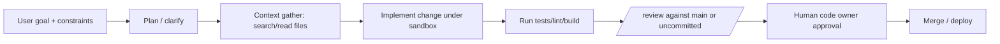

# Best Practices for Using Codex in Visual Studio Code and Building Ownership-Centered Coding Agents

## Executive summary

Codex (as of March 23, 2026) is best operated in Visual Studio Code via the official Codex IDE extension (Marketplace: “Codex – OpenAI’s coding agent”), which uses the same underlying agent as the Codex CLI and shares the same configuration and guard-rail mechanisms. citeturn33search0turn24view0turn21view3

The highest-leverage “current best practices” cluster into six themes:

- **Use the IDE extension for interactive work; use `codex exec` for automation.** Interactive local work benefits from tight sandbox + approvals, fast iteration, and file-level context. Automation benefits from read-only defaults, JSONL streams, schema-constrained outputs, and explicit auth provisioning. citeturn24view3turn30view0turn31view0  
- **Treat local vs cloud as an execution-mode decision, not a “different product.”** Local execution relies on OS-level sandboxing and approvals. Cloud execution runs in isolated containers with an offline-by-default agent phase; enabling internet is a deliberate risk trade. citeturn9view5turn26view5turn24view2  
- **Make “agent ownership” a governance property of the codebase.** The practical mechanisms are (1) enforced sandbox/approval policies, (2) command allow/deny rules, (3) auditable instruction layers (`AGENTS.md`, skills, subagent manifests), (4) mandatory human review gates, and (5) telemetry/audit exports appropriate for your compliance posture. citeturn13view0turn6view0turn7view0turn12view2turn15view0  
- **Optimize for verification loops, not verbose reasoning.** Codex and GPT‑5.4 guidance emphasizes explicit completion criteria, structured output contracts, and verification steps (tests, linters, review) rather than prompting for long preambles that can prematurely terminate agent runs. citeturn18view4turn29view0turn28view1  
- **Control latency and cost primarily through: model choice, reasoning effort, context hygiene, and caching.** GPT‑5.4 is the recommended general default for API-based coding, while Codex-tuned models (e.g., `gpt-5.3-codex`) remain relevant where coding-agent “tool discipline” and autonomy are central. Higher reasoning effort increases latency and burns tokens/rate limits; treat it as a per-task knob. citeturn27view0turn24view0turn28view0  
- **Bake observability in from day one.** For local clients, OpenTelemetry export is the primary best-practice path; for ChatGPT-authenticated enterprise usage, Analytics + Compliance APIs cover adoption, cost monitoring, and auditable prompts/responses (with retention caveats). citeturn15view0turn15view1turn12view2  

Assumptions (because the request did not specify): a Git-based repo; a CI system (likely GitHub Actions, but patterns generalize); a mixed-language codebase; at least moderate security requirements; and that “agent ownership” means humans remain accountable while the agent is allowed to propose, implement, and validate changes under controllable autonomy. Where stricter requirements exist (regulated workloads), prefer read-only defaults, schema-validated outputs, redacted telemetry, and enterprise retention controls. citeturn30view0turn15view1turn34search4turn34search6  

## Codex in Visual Studio Code

### Official integration surface and how it works

The official path is the Codex IDE extension distributed on the Visual Studio Code Marketplace (listing: “Codex – OpenAI’s coding agent”). It supports delegating larger jobs to Codex in the cloud and signing in with a ChatGPT account for included-plan access. citeturn33search0  

The IDE extension **uses the Codex CLI under the hood** and **shares the same configuration** (model choice, sandbox, approvals) via `~/.codex/config.toml` and optional project overrides. This is a key best practice: keep IDE-specific settings minimal; put behavioral controls in Codex configuration so they apply consistently across CLI, IDE, and automation. citeturn21view3turn5view2turn24view0  

The extension is explicitly designed to work not only in Visual Studio Code, but also in VS Code–compatible editors (e.g., Cursor, Windsurf) and even additional IDE families (e.g., JetBrains via a separate distribution). citeturn33search1turn24view0  

image_group{"layout":"carousel","aspect_ratio":"16:9","query":["OpenAI Codex VS Code extension screenshot","Codex IDE extension cloud delegation UI","Codex CLI terminal UI screenshot","Codex analytics dashboard screenshot"],"num_per_query":1}

### VS Code extension controls you should standardize

The Codex IDE doc set enumerates a small number of VS Code settings; most operational safety and behavior should live in Codex config rather than editor settings. Notable IDE settings include:

- `chatgpt.runCodexInWindowsSubsystemForLinux` (Windows only): recommended to run Codex in WSL for improved sandbox security and performance; agent mode on Windows requires WSL. citeturn21view0turn9view1  
- `chatgpt.commentCodeLensEnabled`: optional CodeLens to complete TODO comments with Codex. citeturn21view0  
- `chatgpt.openOnStartup`: optionally focus the Codex sidebar at startup. citeturn21view0  

**Template: VS Code `settings.json` (team baseline)**

```json
{
  "chatgpt.openOnStartup": false,
  "chatgpt.commentCodeLensEnabled": true,

  // Windows: keep the agent inside WSL semantics whenever possible.
  "chatgpt.runCodexInWindowsSubsystemForLinux": true
}
```

These settings complement (not replace) VS Code’s own security model: extensions run with the same privileges as the editor and can read/write files, run external processes, and make network requests. From a governance perspective, you should treat “installing an agentic coding extension” as equivalent to granting significant local capability. citeturn32search1  

### Workspace trust and the “untrusted repo” posture

VS Code’s Workspace Trust / Restricted Mode exists specifically to reduce risk when opening untrusted code; it can limit workspace settings, tasks/debugging, and extension behaviors. Overriding extension trust is possible via settings, so enterprise setups typically standardize trust posture and extension allowlists rather than leaving this to ad hoc user choice. citeturn32search0  

Codex adds a parallel concept: project-level config layers (e.g., `.codex/config.toml`) are loaded only when the project is trusted, explicitly to prevent configuration-based escalation in untrusted repositories. citeturn5view2  

**Best-practice implication:** treat these as complementary layers:

- VS Code Workspace Trust controls **editor capabilities**. citeturn32search0  
- Codex “trusted project” controls whether local/project config is allowed to influence the agent. citeturn5view2  

### Core IDE workflows and commands worth operationalizing

The IDE extension exposes command palette entries (bindable to shortcuts) such as:

- `chatgpt.addToThread`, `chatgpt.addFileToThread` (explicit context injection)
- `chatgpt.newChat` (new thread)
- `chatgpt.implementTodo` (TODO completion flow) citeturn22view1  

It also exposes slash commands inside the chat composer, crucial for repeatable workflows:

- `/local` and `/cloud` to switch execution mode (local workspace vs cloud task) citeturn23view0turn24view2  
- `/auto-context` to toggle automatic inclusion of recent files/IDE context citeturn23view0  
- `/review` for code review mode (uncommitted changes or base-branch comparison) citeturn23view0turn18view5  
- `/status` to show thread ID, context usage, and rate limits citeturn23view0turn24view0  

**Practice:** document your team’s “default loop” as (a) `/local`, (b) implement, (c) run tests, (d) `/review`, (e) open PR, (f) hand to human owner(s).

## Execution modes, authentication patterns, and cost–latency tradeoffs

### Local vs cloud execution: what actually changes

Codex security controls are framed as two layers: **sandbox mode** (technical capability) and **approval policy** (when the agent must ask). citeturn9view5  

- **Codex cloud** runs in isolated OpenAI-managed containers. It uses a **two-phase runtime model**: setup can access the network for installing dependencies; the agent phase is offline by default unless you enable internet access for the environment. Secrets are available only during setup and removed before the agent phase. citeturn9view5turn26view5  
- **Codex CLI / IDE extension** enforces sandbox policies via OS-level mechanisms; defaults typically disable network and limit writes to the active workspace unless configured otherwise. citeturn9view5turn9view1  

**Cloud internet access is a deliberate escalation.** The cloud internet access guide calls out risks: prompt injection from untrusted web content, exfiltration of code/secrets, malware/vulnerable deps, and license-restricted content; it recommends domain allowlists and restricted HTTP methods (e.g., only `GET/HEAD/OPTIONS`). citeturn26view0turn26view1  

### Authentication: align auth method with governance and data policy

Codex supports two auth modes for OpenAI models:

1) **Sign in with ChatGPT** (subscription/workspace access).  
2) **Sign in with an API key** (usage-based API billing). citeturn11view0  

Key best-practice distinctions:

- Codex cloud requires ChatGPT sign-in; CLI and IDE extension support both. citeturn11view0  
- ChatGPT sign-in follows your ChatGPT workspace permissions and (for enterprise) retention/residency settings; API-key usage follows your API org’s retention/data-sharing settings. This is a governance decision, not just a convenience setting. citeturn11view0turn34search1turn34search6  
- API-key auth is recommended for programmatic CLI workflows (CI/CD). citeturn11view0turn30view0  
- Credential caching exists and can be stored in plaintext at `~/.codex/auth.json` unless you configure OS keyring storage (`cli_auth_credentials_store = "keyring"`). Treat this file as a password. citeturn11view0  
- Managed environments can enforce login method/workspace (`forced_login_method`, `forced_chatgpt_workspace_id`). citeturn11view0  

### Model choice and reasoning effort: the primary latency/cost knobs

OpenAI’s model guidance (API docs) recommends **`gpt-5.4` as the default for complex reasoning and coding**, with `gpt-5.4-mini` and `gpt-5.4-nano` for lower cost/latency workloads. Prices and context windows are published: for example, `gpt-5.4` lists a 1M context window and pricing per million tokens. citeturn27view0  

The code generation guide specifically notes that Codex works well with the latest GPT‑5 family models and that starting with `gpt-5.4` is recommended for most code generation tasks, even though Codex-tuned models exist. citeturn28view0  

In the IDE extension, **reasoning effort** is explicitly framed as a tradeoff: higher effort can help on complex tasks but takes longer and uses more tokens, consuming rate limits faster (especially with GPT‑5‑Codex). citeturn24view0turn24view0  

The API changelog is also relevant to performance planning: OpenAI states inference optimizations made `gpt-5.2` and `gpt-5.2-codex` run ~40% faster without changing weights. citeturn28view2  

### Comparison table: execution architectures and tradeoffs

| Option | Where commands run | Typical auth | Strengths | Primary risks / costs | When it’s best |
|---|---|---|---|---|---|
| Codex IDE extension (local mode) | Developer machine / WSL | ChatGPT or API key citeturn11view0turn21view0 | Tight dev loop; file-tag context; approvals; `/review` | Extension privilege footprint; local secret exposure if poorly sandboxed citeturn32search1turn9view5 | Day-to-day feature work, debugging, test-driven edits |
| Codex IDE extension (cloud delegation) | OpenAI-managed container env | ChatGPT + configured cloud env citeturn24view2turn11view0 | Offload large jobs; keep IDE interaction; cloud isolation | Internet-access escalation risks; environment drift; output still needs local verification citeturn26view0turn24view2 | Long-running tasks, parallelizable refactors, repo exploration |
| Codex CLI interactive | Developer machine | ChatGPT or API key citeturn15view3turn11view0 | Full TUI; reproducible workflows; shared config | Same local risks as IDE; requires discipline on approvals | Power users, terminal-centric teams |
| `codex exec` non-interactive | CI runner / script | API key recommended citeturn30view0turn11view0 | JSONL event streams; schema outputs; pipeline-friendly | Must constrain permissions; prompt injection via CI inputs; key management | Automated review, release notes, CI autofix experiments |
| Custom integration via Responses API | Your app/server | API key/org controls citeturn28view0turn34search1 | Full control; tool orchestration design; advanced governance hooks | Engineering overhead; must implement guard rails yourself | Internal developer platforms, multi-repo orchestration |

## Debugging, testing, CI/CD, and repo integration

### The “agentic dev loop” inside VS Code

OpenAI’s Codex best practices emphasize giving clear task context and completion criteria (“Goal, Context, Constraints, Done when”), planning first for complex tasks, and turning repeatable guidance into repository instructions files (`AGENTS.md`). citeturn18view4turn18view5  

For debugging and testing, the same guide emphasizes reliability via explicit loops: ask Codex to create tests where needed, run checks, confirm results, and then review. It calls out `/review` as a practical review entrypoint (base branch, uncommitted changes, commit review, custom instructions). citeturn18view5turn23view0  

**Template: “debug + tests” prompt (IDE local mode)**

```text
Goal: Fix the failing test(s) and prevent regression.

Context:
- The failing output is:
  <paste test output>
- Relevant modules are: @path/to/module_a.ts, @path/to/module_b.ts
- The test file is: @path/to/module_a.test.ts

Constraints:
- Minimal diff; no refactors unless required to fix root cause.
- Match existing patterns in this repo.
- Do not add new dependencies without asking.

Done when:
- The specific failing test passes, and the relevant test suite passes.
- Add/adjust at least one test that would have failed before the fix.
- Provide a short summary + the exact commands you ran.
```

This aligns with the official “Goal/Context/Constraints/Done when” guidance. citeturn18view4  

### CI/CD patterns: make Codex outputs machine-checkable

The Codex non-interactive guide positions `codex exec` as the standard primitive for CI and scripts. It highlights crucial pipeline properties:

- streams progress to `stderr`, prints only the final agent message to `stdout`  
- defaults to read-only sandbox; permissions must be explicitly expanded (`--full-auto`, `--sandbox danger-full-access`)  
- can emit JSONL streams with `--json` (event types include turn start/complete/fail and item-level events)  
- supports schema-constrained final output via `--output-schema`  
- provides a dedicated CI auth pattern, including `CODEX_API_KEY` (supported only in `codex exec`) citeturn30view0  

**Template: schema-constrained “risk report” for CI**

`schema.json`:

```json
{
  "type": "object",
  "additionalProperties": false,
  "required": ["summary", "risk_level", "findings"],
  "properties": {
    "summary": { "type": "string" },
    "risk_level": { "type": "string", "enum": ["low", "medium", "high"] },
    "findings": {
      "type": "array",
      "items": {
        "type": "object",
        "additionalProperties": false,
        "required": ["title", "file", "line_start", "line_end", "recommendation"],
        "properties": {
          "title": { "type": "string" },
          "file": { "type": "string" },
          "line_start": { "type": "integer" },
          "line_end": { "type": "integer" },
          "recommendation": { "type": "string" }
        }
      }
    }
  }
}
```

Run:

```bash
codex exec --sandbox read-only \
  --output-schema ./schema.json \
  -o ./codex-risk.json \
  "Review the diff against main. Return a risk report in the output schema."
```

Schema output in `codex exec` is explicitly recommended for stable downstream automation. citeturn30view0  

### GitHub integration: official action and review workflows

The Codex GitHub Action (`openai/codex-action@v1`) is the officially documented way to run Codex in GitHub Actions workflows. It installs the CLI, starts a Responses API proxy when you provide an API key, and runs `codex exec` under specified permissions. citeturn31view0  

The action documentation includes a security checklist that reflects “current best practice” for agent ownership in CI:

- restrict who can start workflows (`allow-users`, `allow-bots`)  
- sanitize prompt inputs sourced from PR text/commit messages/issues to reduce prompt injection  
- keep `safety-strategy` on `drop-sudo` (or run as an unprivileged user); never leave in `unsafe` mode on multi-tenant runners  
- run Codex late in the job; rotate keys if exposure suspected citeturn31view0  

**Template: PR review workflow (GitHub Action)**  
(Adapted from the official example; keep your prompt in-repo for reviewability.)

```yaml
name: Codex pull request review
on:
  pull_request:
    types: [opened, synchronize, reopened]

jobs:
  codex:
    runs-on: ubuntu-latest
    permissions:
      contents: read
      pull-requests: write
    steps:
      - uses: actions/checkout@v5
        with:
          ref: refs/pull/${{ github.event.pull_request.number }}/merge

      - name: Run Codex review
        id: run_codex
        uses: openai/codex-action@v1
        with:
          openai-api-key: ${{ secrets.OPENAI_API_KEY }}
          prompt-file: .github/codex/prompts/review.md
          safety-strategy: drop-sudo
          sandbox: read-only
```

This pattern is directly supported by official documentation. citeturn31view0  

### Testing workflows: codify “what good looks like”

Codex best practices recommend encoding build/test/lint commands and PR expectations in `AGENTS.md`, keeping it short and accurate, and updating it when mistakes repeat. citeturn18view5turn7view0  

**Template: `AGENTS.md` snippet for tests and review**

```md
## Build and test
- After any code changes, run: `make test`
- If you touch frontend code, also run: `pnpm lint`

## PR expectations
- Keep diffs minimal and scoped.
- Add or update tests for behavior changes.
- Before proposing completion, run `/review` (or equivalent) against main.

## Safety constraints
- Never exfiltrate code or secrets.
- Do not enable network access unless explicitly requested.
```

Instruction layering and discovery behavior for `AGENTS.md` (global + repo + subdir overrides, with size caps and fallback filenames) is documented; use it to make verification predictable across developers and sessions. citeturn7view0turn7view1turn18view5  

## Governance, guard rails, telemetry, and compliance

### Ownership-centered governance model for a codebase

A rigorous “agent ownership” model separates **capability** from **authority**:

- Capability: what Codex can technically do (edit files, run commands, call external tools).  
- Authority: what changes are allowed to land, under what approvals, and with what audit trail.

Codex’s official mechanisms map neatly onto that separation:

- sandbox mode + approval policy define capability and interactive checkpoints citeturn9view5turn9view0  
- admin-enforced requirements and defaults define organization authority boundaries citeturn13view0turn13view5  
- rules files define command-level policy (allow/prompt/forbid) with testable matching citeturn6view0  
- Compliance/Analytics exports (for ChatGPT-authenticated enterprise use) define auditability citeturn12view2  
- OpenTelemetry export defines local observability with configurable prompt redaction citeturn15view0turn15view1  

In practice, “ownership” should remain with designated humans (maintainers / code owners), while Codex is treated as a contributor whose actions are constrained, reviewable, and attributable.

### Role-based access and policy enforcement

Codex enterprise managed configuration supports two distinct admin control types:

- **Requirements (`requirements.toml`)**: enforced constraints users can’t override.  
- **Managed defaults (`managed_config.toml`)**: startup values users can change per session, but which reapply next launch. citeturn13view0turn13view1  

Requirements can constrain security-sensitive settings (approval policy, sandbox mode, web search mode) and optionally which MCP servers can be enabled, enforcing allowlists by server identity. citeturn13view0  

It also supports multiple layers and deployment channels (cloud-managed requirements for ChatGPT Business/Enterprise; macOS MDM; system files), allowing realistic enterprise rollouts. citeturn13view0turn13view4  

**Template: `requirements.toml` (enforce safe autonomy + block risky modes)**

```toml
allowed_approval_policies = ["untrusted", "on-request"]
allowed_sandbox_modes = ["read-only", "workspace-write"]
allowed_web_search_modes = ["cached"]  # allow cached; effectively blocks live search

[rules]
prefix_rules = [
  { pattern = [{ token = "rm" }], decision = "forbidden", justification = "Use git clean -fd instead." },
  { pattern = [{ token = "git" }, { any_of = ["push", "commit"] }], decision = "prompt", justification = "Require explicit approval before mutating history." }
]
```

This mirrors documented examples: requirements rules must be `prompt` or `forbidden` (not `allow`), and enforced rules merge with normal rules where the most restrictive decision wins. citeturn13view2turn13view0  

### Sandboxing, approvals, and safe defaults

Codex documents common sandbox+approval combinations, including a CI-friendly “read-only non-interactive” configuration and the cautionary “bypass everything” YOLO mode. citeturn9view0turn9view1  

A practical “best practice baseline” for normal development is:

- `workspace-write` with approvals on request (or untrusted-only approvals), network disabled by default  
- elevate only in controlled containers or narrowly crafted workflows citeturn9view1turn13view5  

Codex also protects sensitive paths even in writable roots (e.g., `.git`, `.codex`, `.agents` are protected read-only), reducing accidental corruption of repo metadata and agent configuration. citeturn9view4  

### Command governance: rules files and policy testing

Codex’s rules system:

- matches commands by argument-list prefix patterns  
- supports decisions: `allow`, `prompt`, `forbidden`  
- supports “unit tests” (`match` / `not_match`) validated on load  
- treats shell wrappers (`bash -lc`, etc.) specially by splitting safe linear command chains; advanced shell features prevent splitting, pushing the system toward conservative behavior citeturn6view0  

It also provides a testing tool: `codex execpolicy check` to inspect matching decisions before enforcing policy, making rules changes reviewable in code review. citeturn6view0  

**Template: `.rules` snippet (block exfil patterns; prompt on network tools)**  
(Representational; adapt to your environment.)

```python
prefix_rule(
  pattern=["curl"],
  decision="prompt",
  justification="Network egress requires explicit approval."
)

prefix_rule(
  pattern=["bash", "-lc"],
  decision="prompt",
  justification="Shell wrappers can hide multiple actions; review before execution."
)

prefix_rule(
  pattern=["rm", "-rf", "/"],
  decision="forbidden",
  justification="Destructive; no legitimate use in this repo."
)
```

(Use `codex execpolicy check` to validate how these rules apply.) citeturn6view0  

### Rate limits, quotas, and safe throttling

Codex surfaces rate limits in IDE `/status` (thread/context usage and rate limits). Higher reasoning effort consumes more tokens and can exhaust rate limits faster. citeturn23view0turn24view0  

For API-driven automation, OpenAI’s rate limit guidance frames limits as caps on requests/tokens per period. Model pages also expose tier-based RPM/TPM (example shown on `gpt-5.4-pro`). Your usage tier can increase with spend; plan for explicit backoff/retry policies in automation. citeturn34search0turn34search5  

**Practical throttling best practices (automation):**

- cap concurrency (especially when spawning subagents; each thread consumes tokens) citeturn8view0turn8view2  
- prefer schema-constrained outputs to avoid re-runs caused by parsing ambiguity citeturn30view0  
- log token usage from `codex exec --json` events and enforce per-job budgets citeturn30view0  

### Telemetry and observability (local + enterprise)

Codex supports opt-in OpenTelemetry export in advanced config, intended to capture structured events covering runs (API requests, stream events, prompts, tool approvals/results). Prompt text export is redacted by default (`log_user_prompt = false`) and should be enabled only when policy permits. citeturn15view0turn15view1turn13view5  

Managed configuration examples explicitly recommend pinning OTel exporter/environment centrally while keeping prompt logging off unless explicitly allowed—this is an ownership and compliance control, not just an engineering preference. citeturn13view5turn15view1  

For ChatGPT-authenticated enterprise usage, Codex provides:

- Analytics Dashboard and Analytics API (adoption + code review impact metrics)  
- Compliance API exports for audit/investigations, including prompt text and responses, metadata (workspace/user/time/model), and token usage. Audit logs are retained up to 30 days (for the Compliance API). citeturn12view2turn34search8  

### Legal and compliance considerations you should encode into policy

Key “current” policy anchors from entity["company","OpenAI","ai research company"] sources:

- Terms of Use (Jan 1, 2026) state you retain ownership of input and (to the extent permitted by law) own the output. citeturn34search9  
- Enterprise privacy messaging emphasizes: business data is not used for training by default; you own inputs/outputs; retention controls exist for qualifying organizations. citeturn34search6turn34search4  
- Platform “Your data” guidance distinguishes abuse monitoring logs and application state, reinforcing that retention and logging are part of the threat model for any agentic system. citeturn34search1  
- Compliance logs retention (30 days) requires downstream capture if your policy demands longer retention. citeturn34search8  

**Policy snippet (template): “AI-assisted code changes”**

```text
- Human accountability: A human code owner remains responsible for changes merged to protected branches.
- Separation of duties: Codex may propose and implement changes, but cannot be the sole approver.
- Data minimization: Do not paste secrets; do not enable live internet unless required and approved.
- Auditability: PRs must include (a) test evidence, (b) review output, and (c) a short change rationale.
- Retention alignment: Telemetry exports must redact prompts by default; enabling prompt logging requires Security + Legal approval.
```

This template is designed to align with documented controls (approvals/sandbox, OTel prompt redaction, internet-access risk) and enterprise audit capabilities. citeturn9view5turn15view0turn26view0turn12view2  

## Prompting and agent-building patterns for ownership and reliability

### Prompt engineering patterns that map to ownership

Codex best practices recommend a default prompt structure: Goal, Context, Constraints, Done when. This structure is “ownership-friendly” because it makes scope, standards, and completion verifiable. citeturn18view4  

For difficult tasks, official guidance suggests planning first (Plan mode) rather than jumping into edits, and then encoding stable guidance in `AGENTS.md` so it becomes consistent across sessions/surfaces. citeturn18view4turn18view5  

The Codex Prompting Guide (Feb 25, 2026) adds a crucial harness-level insight: avoid prompting for upfront status preambles and plans during the rollout because it can cause the model to stop before completing work; instead, bias the agent toward autonomy/persistence and toward tool-based operations (search/read/apply_patch) over raw shell. citeturn29view0  

**Template: ownership-centered “implementation contract”**  
(Use as a reusable block in prompts or skills.)

```text
<completeness_contract>
- Deliver a working change, not just a plan.
- Stay within the smallest defensible diff.
- Verify with the repo’s standard checks (tests/lint/build).
- If blocked, stop and report: (a) what you tried, (b) evidence, (c) the minimal question.
</completeness_contract>
```

This matches the GPT‑5.4 prompt guidance emphasis on explicit output contracts, verification loops, and completion criteria. citeturn28view1  

### Few-shot, structured prompts, and avoiding “chain-of-thought dependence”

“Few-shot” is most valuable where you want stable formatting and predictable tool routing—especially for smaller models or automation. GPT‑5.4 guidance recommends using explicit scaffolding and examples for smaller variants, and emphasizes structured outputs and verification loops over relying on implicit reasoning. citeturn28view1turn27view0  

For automation, schema-constrained outputs (`--output-schema` in `codex exec`) are the most robust “structured prompt” mechanism because they couple prompting with machine validation. citeturn30view0  

**Template: few-shot “review finding” (schema-aligned)**

```text
Return JSON that matches the schema.
Example finding:
{
  "title": "Potential race when updating cache",
  "file": "src/cache.ts",
  "line_start": 92,
  "line_end": 118,
  "recommendation": "Guard with mutex or atomic swap; add concurrency stress test."
}
Now review the diff against main and produce findings.
```

### Context window management and state

Codex conceptualizes work as **threads** and **turns**; a thread can include multiple prompts (implement, then add tests, then review) and can be resumed. Avoid having two threads modify the same files concurrently. citeturn19search4  

For extended work, compaction is positioned as a first-class mechanism to sustain multi-hour autonomy without hitting context limits, and is explicitly called out as a key improvement in Codex models and GPT‑5.4 guidance. citeturn29view0turn28view2turn28view1  

### Memory, skills, and reusable “team ownership defaults”

Codex’s “Customization” guidance describes a layered mechanism:

- `AGENTS.md` for persistent repo operating agreements  
- skills as folder-based workflow packages (with `SKILL.md` and optional scripts/references/assets), using progressive disclosure (metadata first; load details only when needed) to reduce context pollution and keep behavior consistent citeturn19search6turn19search2turn7view0  

This is an ownership tool: it moves “how we do things” out of ephemeral chats and into reviewable artifacts in the repo.

**Template: skill folder structure**

```text
.agents/skills/release-manager/
  SKILL.md
  scripts/
  references/
  assets/
```

This structure is consistent with the folder-based skills convention described in Codex changelog excerpts and customization guidance. citeturn19search20turn19search6  

### Tool use discipline, input/output validation, and fail-safes

The Codex Prompting Guide recommends strongly preferring dedicated tools (`read_file`, `rg`, `apply_patch`, git tools) over raw terminal when possible, and it recommends output truncation strategies to keep tool responses in-distribution. citeturn29view0  

For fail-safes in automation, `codex exec` provides explicit “safe default” semantics:

- read-only sandbox by default  
- `--ephemeral` to avoid persisting rollout logs (useful in sensitive environments)  
- if an MCP server is marked required and fails, `codex exec` exits with an error rather than silently continuing  
- Git repository requirement to prevent destructive changes; can be overridden with `--skip-git-repo-check` only if you deliberately accept the risk citeturn30view0  

These behaviors should be treated as part of your guard-rail design: error loudly, stop on missing dependencies, and refuse to run in contexts likely to cause damage.

### Subagents, orchestration, and handoff protocols

Codex supports explicit subagent workflows: it can spawn specialized agents in parallel and consolidate results. This is powerful for parallel review (security, correctness, tests, maintainability) but increases token usage because each subagent performs model/tool work. Subagent activity is currently visible in the app and CLI, with IDE visibility described as “coming soon” (as documented). citeturn8view0  

Subagents inherit the sandbox policy. Global controls include caps such as `agents.max_threads` and `agents.max_depth` (default depth 1); deeper recursion increases cost/latency and predictability risk. citeturn8view2turn8view0  

**Mermaid: agent–subagent relationship (ownership-oriented)**

```mermaid
graph TD
  A[Primary Agent: Repo Owner Proxy] --> B[Subagent: Code Explorer (read-only)]
  A --> C[Subagent: Reviewer (read-only, high effort)]
  A --> D[Subagent: Test Engineer (workspace-write)]
  A --> E[Subagent: Docs/Dependency Researcher (MCP, restricted)]
  B --> A
  C --> A
  D --> A
  E --> A
```

This maps to documented patterns: custom agents can specify model/effort/sandbox and are designed to be narrow and opinionated (e.g., a read-only explorer, a high-effort reviewer). citeturn8view5turn8view2turn8view0  

**Mermaid: orchestration flow with approvals and verification gates**



This mirrors Codex best-practice emphasis on plan-first for complex tasks, verification loops, and review before acceptance. citeturn18view4turn18view5turn23view0  

**Handoff protocol template (subagents):**  
Require every subagent to return a compact, structured handoff:

```text
Return:
- status: {blocked|done|needs_human_decision}
- evidence: file paths + line ranges
- risks: top 3
- recommended next action: one step
- test impact: what to run / what ran
```

This is consistent with the broader “structured outputs + verification” guidance in GPT‑5.4 prompt guidance and Codex’s own review-oriented workflows. citeturn28view1turn18view5  

### Performance metrics that align with ownership

For enterprise Codex usage authenticated through ChatGPT, Codex’s governance docs define telemetry surfaces and what they measure:

- daily usage/adoption by surface (including daily VS Code extension users)  
- code review activity (reviews completed, comments generated, severity breakdown)  
- engagement metrics (replies, reactions)  
- Compliance exports include prompt/response content and token usage, but explicitly do not attempt noisy productivity proxies like lines of code generated. citeturn12view5turn12view2  

For local and CI usage, OpenTelemetry export plus `codex exec --json` streams provide the raw material for metrics like:

- time-to-green (tests passing)  
- patch size and rework rate  
- tool approval frequency (proxy for autonomy friction)  
- token spend per workflow stage citeturn15view0turn30view0turn15view1  

The ownership-aligned metric principle is: measure outcomes (test pass rate, defect rates, review severity, time-to-remediation), not speculative proxies that encourage perverse incentives.

