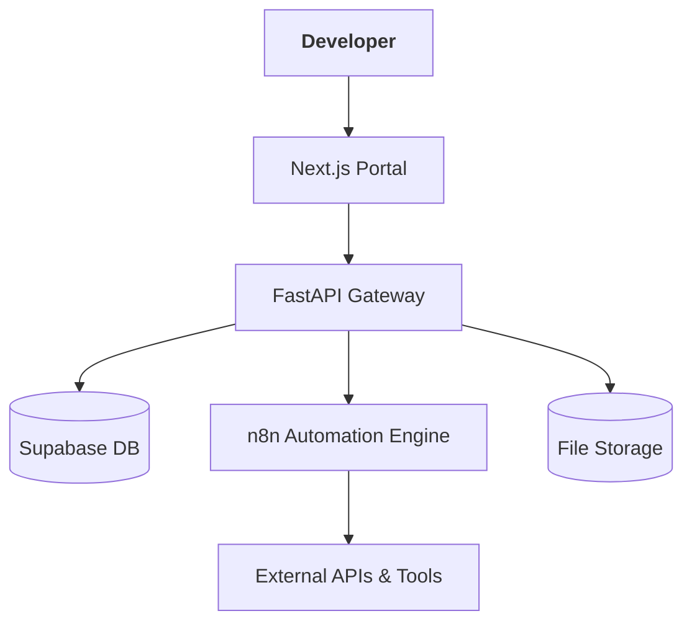

# System Architecture

The API HUB follows a layered architecture to separate the developer experience from the automation engine.

## The 5-Component Stack

### 1. Frontend: Developer Portal (Next.js)
- **Role**: The "Face" of the platform.
- **Features**: Landing page, documentation, user dashboard, API key management, and usage analytics.
- **Tech**: Next.js (App Router), Tailwind CSS, shadcn/ui.

### 2. Backend: API Gateway (FastAPI)
- **Role**: The "Control Plane".
- **Responsibilities**:
    - Authenticating API keys.
    - Rate limiting and usage logging.
    - Proxying valid requests to n8n.
    - Managing async job status.
- **Tech**: Python 3.10+, FastAPI.

### 3. Database: Data Layer (Supabase)
- **Role**: The "Source of Truth".
- **Stored Data**: User profiles, encrypted API keys, credit balances, usage logs, and job states.
- **Tech**: PostgreSQL (viam Supabase).

### 4. Automation Engine: Service Layer (n8n)
- **Role**: The "Workhorse".
- **Workflows**: Scraping, AI analysis, video/image generation, data enrichment.
- **Interface**: Exposed via Webhook nodes to the FastAPI Gateway.

### 5. Storage: Asset Layer (Supabase/R2)
- **Role**: Hosting generated files (videos, images, reports).
- **Tech**: Supabase Storage or Cloudflare R2.

## Request Flow
1. Developer calls `/v1/service` with an API key.
2. FastAPI validates the key against Supabase.
3. FastAPI logs the request and checks credits.
4. FastAPI triggers an n8n workflow.
5. n8n processes the request and returns data (or a Job ID for async).
6. FastAPI returns the final response to the developer.
